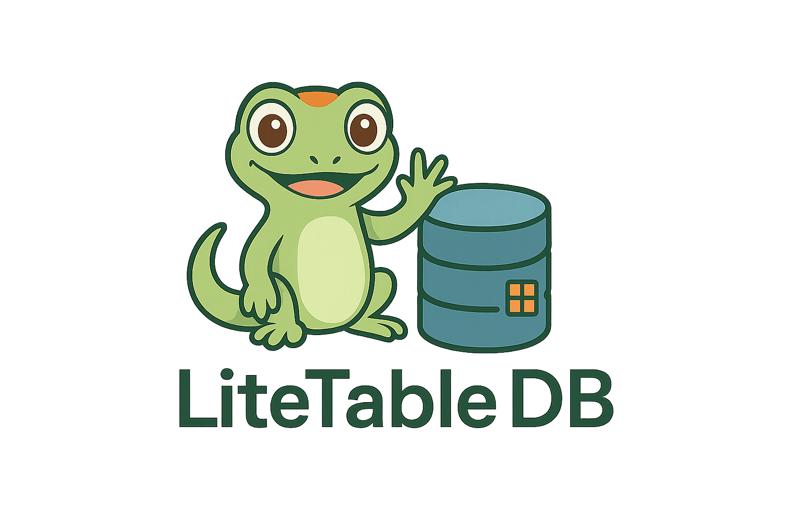

# LiteTable DB
**LiteTable is in active development and should not be considered stable.**



LiteTable is a light-weight (pun intended), high-performance NoSQL database designed for fast 
iteration and developer convenience. It provides a simple, flexible and efficient 
storage solution inspired by column-oriented database systems such as: 
- Google BigTable
- Apache HBase
- Apache Cassandra

and other systems such as Valkey and Prometheus, to name a few.

## Key Features

- **Flexible Data Model**: Store data organized by row keys, column families, and column qualifiers
- **Time-Series Data**: Efficiently store and query time-series data with built-in support for
  versioning and expiration.
- **Garbage Collection**: Flexible delete options allow for automatic expiration and cleanup.
- **CDC Support**: Change Data Capture support for real-time data streaming and 
  integration with other systems.
- **Configurable Backup** Configure backup and restore options for data protection.
---
## Quick Start

LiteTable can be run locally or deployed via Docker:

### LiteTable CLI
To get started with LiteTable DB, just install the CLI. 

1. Install the CLI:
   ```bash
   curl -fsSL https://raw.githubusercontent.com/litetable/litetable-cli/main/install.sh | bash
   ```
2. Initialize a new LiteTable database:
   ```bash
    litetable service init
    ```
   
3. Start the LiteTable server:
   ```bash
   litetable service start
   ```

4. Stop the LiteTable server:
   ```bash
   litetable service stop
   ```

With an initialized server, you can start writing data to it. The first write is to always 
create a supported column family, which is accomplished by a `create` command.
```bash
  litetable create --family <my_family>
```

A valid column family is required for every read and write command.

### Create some data to your column family:
1. With a running server, create a new column family:
   ```bash
   litetable create --family wrestlers
   ```

2. Create a new record for that column family
   ```bash
   litetable write -k champ:1 -f wrestlers -q firstName -v John -q lastName -v Cena -q  
   championships -v 15
   ```
3. Append more data to the row key
   ```bash
   litetable write -k champ:1 -f wrestlers -q championships -v 16 &&
   litetable write -k champ:1 -f wrestlers -q championships -v 17
   ```
4. Read the data back
   ```bash
   litetable read -k champ:1 -f wrestlers
   ```

5. Delete a column qualifier 
   ```bash
   litetable delete -k champ:1 -f wrestlers -q championships
   ```
   
6. Delete with custom TTL (number of seconds before garbage collection)
   ```bash
   litetable delete -k champ:1 -f wrestlers -q championships --ttl 300
   ```
---
## Data Structure
Using the `write` command from above returns the following data.
```json
{
   "key": "champ:1",
   "cols": {
      "wrestlers": {
         "championships": [
            {
               "value": "MTU=",
               "timestamp": "2025-04-26T23:53:38.998676-04:00"
            }
         ],
         "firstName": [
            {
               "value": "Sm9obg==",
               "timestamp": "2025-04-26T23:53:38.998676-04:00"
            }
         ],
         "lastName": [
            {
               "value": "Q2VuYQ==",
               "timestamp": "2025-04-26T23:53:38.998676-04:00"
            }
         ]
      }
   }
}
```


>Notice the values are base64 encoded. This is done to ensure that the data is stored in a
consistent format. All data can be decoded by the conventional ways in their respective languages.

---
## Querying Data
### Time-series entries
LiteTable queries can be configured to return all or the `latestNValue` of a column family. For 
example:
```bash
litetable read -f wrestlers -k champ:1 -l 3
```

This will return the latest 3 entries for every column qualifier in the `champions` family.

```
rowKey: champ:1
family: wrestlers
  qualifier: name
    value 1: John (timestamp: 2025-04-27T00:08:38.15789-04:00)
  qualifier: lastName
    value 1: Cena (timestamp: 2025-04-27T00:08:38.15789-04:00)
  qualifier: championships
    value 1: 17 (timestamp: 2025-04-27T00:08:57.876812-04:00)
    value 2: 16 (timestamp: 2025-04-27T00:08:55.300799-04:00)
    value 3: 15 (timestamp: 2025-04-27T00:08:38.15789-04:00)
```
Because the `name` and `lastName` qualifiers only have less than 3 entries, the `-l` flag will 
return any rows < N.

---
To get the latest 3 entries for a specific column qualifier, you can use the `-q` flag:
```
litetable read -f wrestlers -k champ:1 -q championships -l 3
```

```
rowKey: champ:1
family: wrestlers
  qualifier: championships
    value 1: 17 (timestamp: 2025-04-27T00:08:57.876812-04:00)
    value 2: 16 (timestamp: 2025-04-27T00:08:55.300799-04:00)
    value 3: 15 (timestamp: 2025-04-27T00:08:38.15789-04:00)

```

You can append as many qualifiers as you need:
```
litetable read -f wrestlers -k champ:1 -q championships -q name -l 1
```
---
## Data Storage and Architecture
### In-Memory with Persistent Backup
LiteTable operates primarily as an in-memory database for high performance, with configurable persistence through several mechanisms:

- Incremental Snapshots: Frequent small backups of changed data
- Full Snapshots: Complete database backups at configurable intervals
- Snapshot Merging: Consolidation of incremental snapshots into the main backup

### Tombstone-Based Deletion
LiteTable uses a tombstone pattern for efficient deletions:

- Data isn't immediately removed from memory but marked with a tombstone
- Tombstones have configurable expiration times (TTL)
- A background reaper process purges expired tombstones at regular intervals
- During snapshot merges, tombstoned data is properly removed from persistent storage

### Version Control and Time-Series
Every write to LiteTable is versioned with a timestamp:

- Multiple versions of the same data are stored under one qualifier
- Data can be queried by time or limited to most recent versions
- Historical data access is built-in without complex query syntax

### Concurrency Model
- Read operations are optimized for high throughput
- Write operations maintain data integrity through timestamps
- Built for read-heavy workloads

---
### Proudly written in Go.
LiteTable DB is proudly written in Go and is designed with the modern developer in mind. 
Wide-column NoSQL is the same technology that powers applications like Google Maps, Google 
Sheets, Instagram and Netflix just to name a few.   
